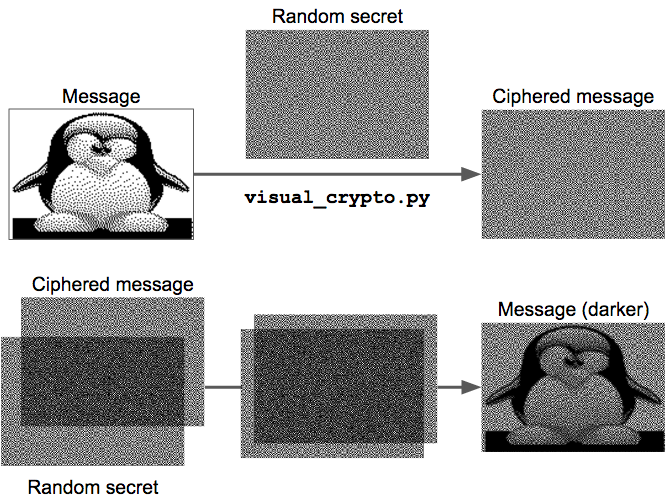

# Visual cryptography tool

A fun visual cryptography tool that will amaze your kids.

## Usage

    $ python visual_crypto.py -vvv --message message.png --secret secret.png

This produces the ciphered image (`ciphered.png`) that looks completely random, just like the random secret image (`secret.png`).

Print `secret.png` on a transparent paper, and `ciphered.png` on regular paper, then place the transparent paper on top of the regular paper, and see the original image suddenly appear in front of you. Make sure to print at exactly the same scale and align both papers perfectly: the image only appears when alignment is perfect.

## Requirements
This program requires the Python Image Library (PIL). The easiest way to install it is using pip:

    $ pip install --upgrade Pillow

## More info
This is a visual variant of the one-time-pad algorithm which is one of the rare crypto algorithms that has been proven to be completely unbreakable. The great thing about it is that you don't need a computer to decipher the messages you receive (but you do need one to generate the ciphered messages). If you were to use this seriously, you would first generate many random secret images and share them securely with the person you want to communicate with, then later you must use one different secret image for each message you want to send. Never reuse a secret image.

Check out the Wikipedia article on [Visual Cryptography](https://en.wikipedia.org/wiki/Visual_cryptography) for more details.

Have fun!